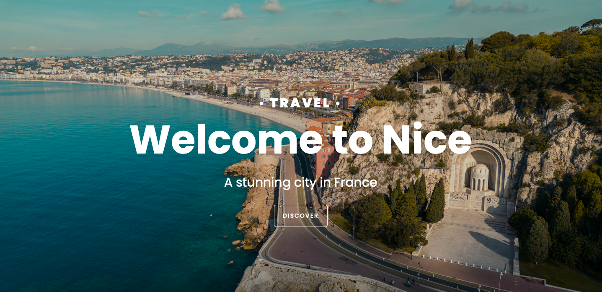

# Travel Showcase Project

## Description
A responsive and interactive website designed to highlight the best aspects of a travel destination. Initially inspired by Nice, France, this project showcases how easily it can be adapted to various locations, making it a versatile template for any travel-related content.

## Features

- **Responsive Design:** The layout adapts seamlessly to different screen sizes, providing an optimal viewing experience on desktops, tablets, and mobile devices.
- **Interactive Content:** Integrates external media like Google Maps and Instagram posts to create a dynamic and engaging user experience.
- **Image Carousel:** A sleek carousel feature to showcase images or highlights in a visually appealing way.
- **Customizable Template:** Easily modify content and design elements to fit different travel destinations.

## Technologies Used
- **HTML5:** Content structure.
- **CSS3:** Styles and layout.
- **Bootstrap 5:** Framework for responsive design.
- **Font Awesome:** Icons for social media links.

## Installation

1. **Clone the repository:**
   git clone https://github.com/yourusername/travel-showcase.git

2. **Navigate to the project folder:**
   cd repository-name

3. **Open the index.html file in a browser to view the project.**

## Contribution

Feel free to fork this repository and contribute by submitting pull requests. Any contributions that enhance the project are welcome!

## License
This project is licensed under the MIT License.

## Contact

Name: Júlia Bacchi
Email: juliabacchi92@gmail.com
Portfolio: (https://portfolio-juliabacchi.netlify.app)

